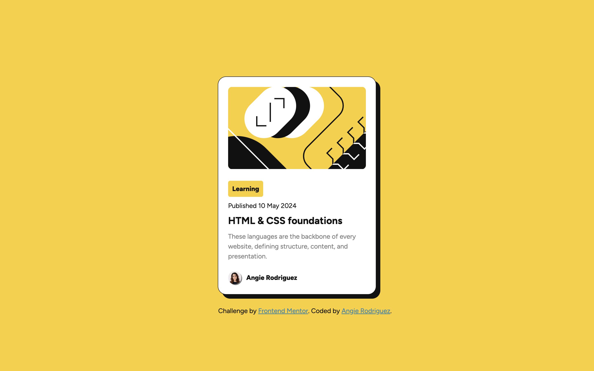

# Frontend Mentor - Blog preview card solution

Hello, my name is Angie and this is my solution to the [Blog preview card solution challenge on Frontend Mentor](https://www.frontendmentor.io/challenges/social-links-profile-UG32l9m6dQ).

## Table of contents

- [Overview](#overview)
  - [The challenge](#the-challenge)
  - [Screenshot](#screenshot)
  - [Links](#links)
- [My process](#my-process)
  - [Built with](#built-with)
  - [What I learned](#what-i-learned)
  - [Continued development](#continued-development)
  - [Useful resources](#useful-resources)
- [Author](#author)
- [Acknowledgments](#acknowledgments)

**Note: Delete this note and update the table of contents based on what sections you keep.**

## Overview

### The challenge

Users should be able to:

- See hover and focus states for all interactive elements on the page

### Screenshot
Desktop View




### Links

- [Solution URL](https://github.com/ARodriguezHacks/blog-preview-card-main)
- [Live Site URL](https://arodriguezhacks.github.io/blog-preview-card-main/)

## My process

### Built with

- Semantic HTML5 markup
- CSS custom properties
- CSS Variable fonts
- CSS animations and transitions
- Flexbox
- Mobile-first workflow

### What I learned

With this purely HTML and CSS project, I solidified more my understanding of the `::before` psuedo-element when it comes to creating neat animations, in addition to the differences between the `animation` and `transition` CSS properties. In the end, it takes some trial and error and an understanding that not all CSS properties can be animated or transitioned, and that it requires some due diligence to figure that out.

```css
#app {
  ...
  animation: 3s ease-in-out 0.5s 1 forwards load;
  ...
  @keyframes load {
    from {
      translate: 0 -130%;
      opacity: 0;
    }
    to {
      translate: 0 0;
      opacity: 1;
    }
  }
}
...
```

### Continued development

For future projects, I'm interested in improving my CSS animations and transitions, especially when loading a web page and if the page requires scrolling,in which case I want to gain more practice with the Intersection Observer Web API. The intent is to use animations and transitions for more seemless user experiences.

### Useful resources

- [Hover for heading text](https://stackoverflow.com/questions/40875736/text-colour-fill-from-left-to-right-using-css) - This helped me create the neat animation when hovering over the `h1` heading.
- [Background-clip property](https://developer.mozilla.org/en-US/docs/Web/CSS/background-clip) - This property was essential for the previously mentioned custom animation.

## Author

- Frontend Mentor - [@ARodriguezHacks](https://www.frontendmentor.io/profile/ARodriguezHacks)
- LinkedIn - [Angie Rodriguez](https://www.linkedin.com/in/angierodriguezdev/)
